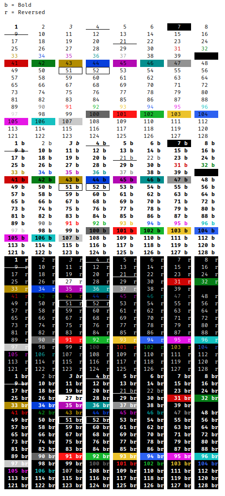
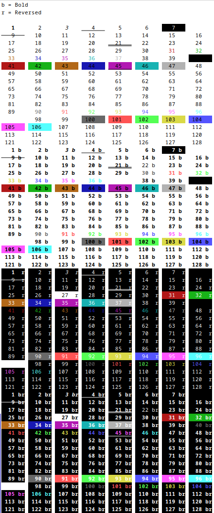

# What's about

Depending on your Console or IDE application, `ANSI` colors might be displayed differently.

Here is a small `Scala` test frame helping identify `ANSI` color codes by example printout ("rainbowing").

The main dimensions for the color code permutations are `Bold` Yes or No?, `Reversed` Yes or No?.

__No blinking__ 

  Since `IntelliJ` log output is one of the target outputs, and `Blinking` is unsupported in `IntelliJ` (as far as I have noticed), `Blinking` is ommited here. 

__IntelliJ Console Output Example__

__Konsole Console Output Example__

Linux Manjaro 
Number 5 is blinking, but You can't see it here.

